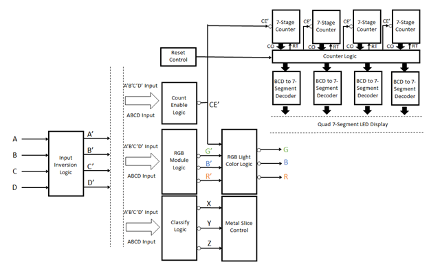
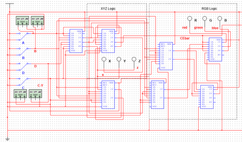
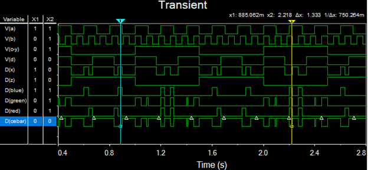

# Battery_Recycle
NI Multism based digital circuit design

## Introductioin
The circuit input is the status of circular metal slice if it is pushed back, each metal slice is represented by A, B, C, D from small to big in diameter, 1 means the slice is pushed back, 0 means it stays still. The circuit output is the status of the flat metal slice in Classification part, each metal slice stands for X, Y, Z which is described in the diagram above, and 1 stands for rotating the slice to the right side, 0 for rotating the slice to the left side, X for do not care. The batteries are split through the flat metal slices to four bags stored specific dry cell.

| A | B | C | D | X | Y | Z | Light | Slot  |   |
|---|---|---|---|---|---|---|-------|-------|---|
| 0 | X | X | X | X | X | X | none  | none  |   |
| 1 | 0 | 0 | 0 | 1 | 0 | X | Blue  | AAA   |   |
| 1 | 1 | 0 | 0 | 0 | X | 1 | Red   | AA    |   |
| 1 | 1 | 1 | 0 | 0 | X | 0 | White | C     |   |
| 1 | 1 | 1 | 1 | 1 | 1 | X | Green | D     |   |

## Architecture

 \
Simplified gate diagram of simulation circuit

 \
Classification and Indicator Logic connection

## Simulation

 \
RGB and XYZ simulation output
